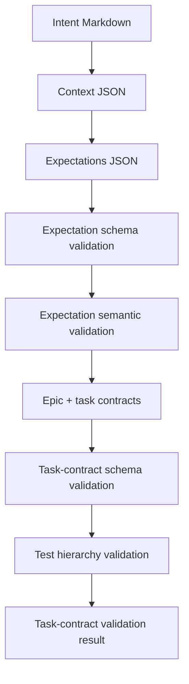

# End-to-End Planning Simulation — v0.6.2

This simulation exercises the planning side of the harness for a local pipeline project before implementation starts.

## Scenario

Intent: build a local pipeline that reads fixture source rows and produces validated output records with lineage and rerun safety.

## Flow exercised



## Commands run

```bash
python -B scripts/schema_validator.py --kind expectations --path docs/expectations/simulated-local-pipeline.json
python -B scripts/validate_expectations.py --expectations docs/expectations/simulated-local-pipeline.json --output docs/validation-reports/simulated-local-pipeline-expectations-validation.json
python -B scripts/schema_validator.py --kind task-contracts --path docs/task-contracts/simulated-local-pipeline.json
python -B scripts/test_strategy.py validate-contracts --contracts docs/task-contracts/simulated-local-pipeline.json
python -B scripts/validate_tasks.py --tasks docs/task-contracts/simulated-local-pipeline.json --output docs/validation-reports/simulated-local-pipeline-task-contract-validation.json
```

## Result

The simulation passed. It produced schema-valid intermediate artifacts:

- `docs/intents/simulated-local-pipeline.md`
- `docs/context/simulated-local-pipeline.json`
- `docs/expectations/simulated-local-pipeline.json`
- `docs/validation-reports/simulated-local-pipeline-expectations-validation.json`
- `docs/task-contracts/simulated-local-pipeline.json`
- `docs/validation-reports/simulated-local-pipeline-task-contract-validation.json`
- `docs/validation-reports/simulated-pipeline-workflow.json`

## Gaps fixed by v0.6.2

- Expectations are now schema-validated and semantically checked.
- Expectation validation produces a structured JSON result.
- Task decomposition now requires top-level epics.
- Every task must reference a declared epic.
- Task validation now checks epics, dependencies, and test hierarchy declarations.
- `/derive-tasks` explicitly routes through `epic-task-decomposition` and `test-hierarchy`.
- `/validate-tasks` now exists as a first-class command.
