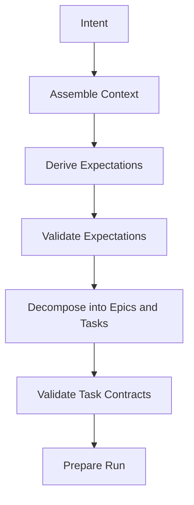

# Planning Output Contracts — v0.6.2

v0.6.2 closes a planning-side enforcement gap.

Before this release, implementation/review/validator outputs were schema-validated, but IDSD planning commands were still largely prompt-driven. The harness now treats planning artifacts as structured outputs too.

## Enforced planning stages



## Required checks

Expectations must validate with:

```bash
python -B scripts/schema_validator.py --kind expectations --path docs/expectations/<intent-id>.json
python -B scripts/validate_expectations.py --expectations docs/expectations/<intent-id>.json --output docs/validation-reports/<intent-id>-expectations-validation.json
```

Task contracts must validate with:

```bash
python -B scripts/schema_validator.py --kind task-contracts --path docs/task-contracts/<intent-id>.json
python -B scripts/test_strategy.py validate-contracts --contracts docs/task-contracts/<intent-id>.json
python -B scripts/validate_tasks.py --tasks docs/task-contracts/<intent-id>.json --output docs/validation-reports/<intent-id>-task-contract-validation.json
```

## Epic requirement

Task decomposition must produce top-level `epics` and every task must reference a declared `epic_id`. This prevents unstructured task lists and makes session reports easier to explain.
