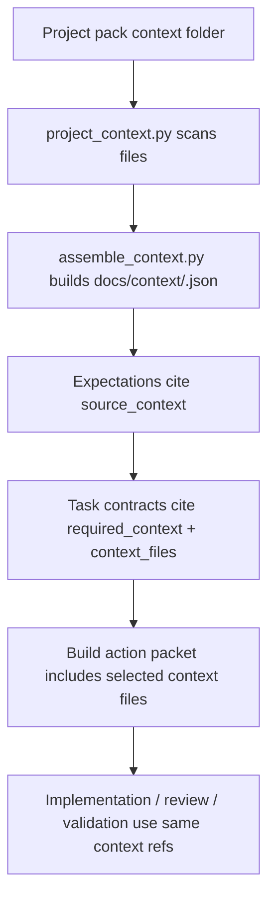

# Project-Pack Context Folder — v0.6.3

v0.6.3 makes `project-packs/<project-name>/context/` a first-class source for IDSD planning and downstream build/review phases.

## Simple setup

A project pack can start with only:

```text
project-packs/<project-name>/context/
├── README.md
└── <one-small-context-file>.md
```

Supported file types:

- `.md`
- `.txt`
- `.json`
- `.yaml`
- `.yml`

## Execution flow



## Deterministic commands

```bash
python -B scripts/project_context.py validate --pack project-packs/<project-name>
python -B scripts/assemble_context.py --intent docs/intents/<intent-id>.md --output-json docs/context/<intent-id>.json --output-md docs/context/<intent-id>.md
python -B scripts/schema_validator.py --kind context-pack --path docs/context/<intent-id>.json
```

## Downstream schema requirements

Expectations must include:

```json
"source_context": {
  "context_pack_path": "docs/context/<intent-id>.json",
  "project_context_files": [
    {"context_id": "CTX-...", "path": "project-packs/<project>/context/file.md", "used_for": ["expectation_derivation"]}
  ]
}
```

Each task contract must include:

```json
"required_context": ["CTX-..."],
"context_files": [
  {"context_id": "CTX-...", "path": "project-packs/<project>/context/file.md", "used_for": ["implementation", "review", "validation"]}
]
```

`validate_expectations.py` and `validate_tasks.py` reject missing context references.
