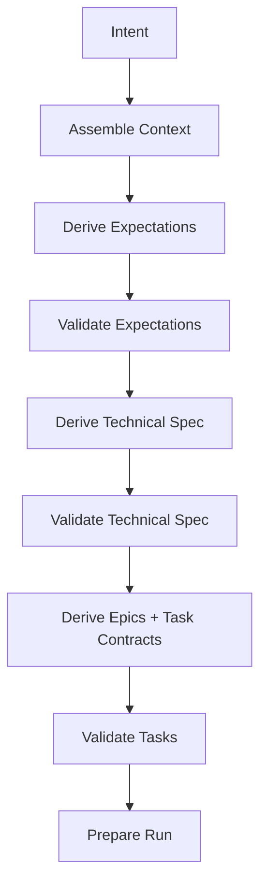

# Technical Spec Stage — v0.6.4

v0.6.4 adds a first-class Technical Spec stage between Expectations and Task Contracts.

## Purpose

The Technical Spec captures implementation-level decisions that should not be silently invented during coding or task decomposition:

- architecture style;
- library/dependency choices;
- module boundaries;
- data flow;
- configuration and secret policy;
- error/rejection handling;
- lineage and idempotency strategy;
- observability;
- testing implications;
- explicit deferred items.

## Artifacts

- `docs/technical-specs/<intent-id>.json`
- `docs/technical-specs/<intent-id>.md`
- `docs/technical-spec-results/<intent-id>.json`
- `docs/validation-reports/<intent-id>-technical-spec-validation.json`

## Enforcement

Task contracts must include:

- top-level `technical_spec` pointing to the spec and validation result;
- per-task `technical_spec_refs` identifying the exact spec sections used by implementation.

`prepare_run.py` now requires both the Technical Spec and its validation result.
