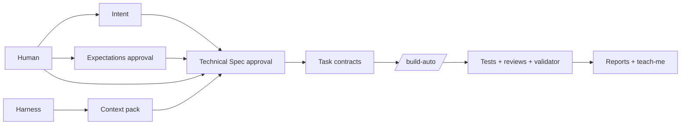
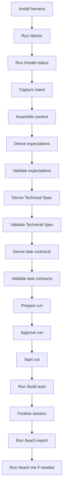
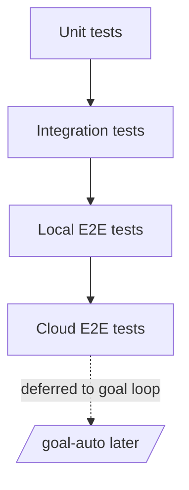
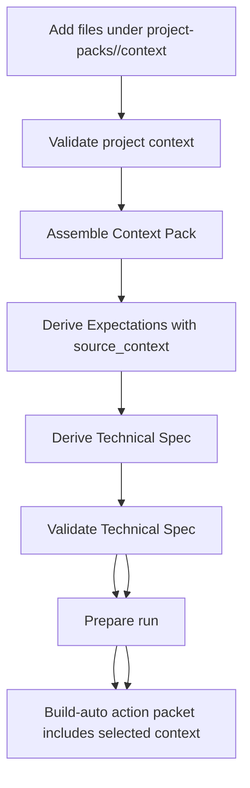

# Operator Manual — Cursor Engineering Harness v0.6.0

This manual explains how to use the harness on a new project from first install to post-run teaching report.

## Operating model

The harness separates human-owned product judgment from machine-owned build mechanics.



## Recommended end-to-end workflow



## Step 1 — Install in a new repository

Copy the harness into your repository root, or run from an unpacked harness folder:

```bash
python -B scripts/install_harness.py --target /path/to/project
cd /path/to/project
python -B scripts/verify_installation.py
```

Then initialize Git if needed and run:

```bash
python -B scripts/harness_doctor.py
python -B scripts/bootstrap_environment.py
```

## Step 2 — Activate the right project pack

For a normal Python project:

```bash
python -B scripts/project_pack.py activate --name generic-python
```

For the invoice-governance project:

```bash
python -B scripts/project_pack.py activate --name invoice-governance
python -B scripts/project_pack.py validate --pack project-packs/invoice-governance
```

## Step 3 — Configure model routing

Edit `harness.config.json` and map aliases to actual models available in your IDE.

Recommended pattern:

| Role | Model class |
|---|---|
| Orchestrator | highest-intelligence model |
| Builder | medium/cheaper coding model |
| Test reviewer | independent reasoning model |
| Principal reviewer | independent reasoning model |
| Validator | strong structured-output reasoning model |
| Domain reviewer | strong semantic/domain model |

Validate:

```bash
python -B scripts/model_router.py validate
python -B scripts/model_router.py status
```

## Step 4 — Write IDSD artifacts

### Intent

Human-owned. Keep it compact.

```text
Goal
Constraints
Failure conditions
Non-goals
```

### Context

Harness-owned. This captures repository, runtime, conventions, project pack and environment.

### Expectations

Human-approved. This defines success/failure scenarios and the testing matrix.

Every Expectations document must state what is tested at:

```text
unit → integration → local_e2e → cloud_e2e
```

Cloud E2E is normally marked as not required for `/build-auto` unless explicit environment authority exists.

## Step 5 — Derive and validate the Technical Spec

The Technical Spec is the bridge between Expectations and Task Contracts. It captures concrete implementation choices: architecture, dependencies, module boundaries, data flow, configuration, error handling, lineage/idempotency, and testing implications.

```bash
python -B scripts/schema_validator.py --kind technical-spec --path docs/technical-specs/<intent-id>.json
python -B scripts/validate_technical_spec.py --spec docs/technical-specs/<intent-id>.json --output docs/validation-reports/<intent-id>-technical-spec-validation.json
python -B scripts/schema_validator.py --kind technical-spec-validation-result --path docs/validation-reports/<intent-id>-technical-spec-validation.json
```

Do not derive tasks until the Technical Spec is validated and human-reviewed.

## Step 6 — Derive task contracts

Task contracts must be vertical slices and must include:

```json
{
  "task_id": "TASK-001",
  "goal": "...",
  "allowed_paths": ["src/...", "tests/..."],
  "forbidden_paths": ["docs/intents/**", ".env"],
  "test_expectations": {
    "highest_required_tier": "local_e2e",
    "unit": {"required": true},
    "integration": {"required": true},
    "local_e2e": {"required": true},
    "cloud_e2e": {"required": false, "not_required_reason": "..."}
  }
}
```

Validate:

```bash
python -B scripts/test_strategy.py validate-contracts --contracts docs/task-contracts/<intent-id>.json
```

## Step 7 — Prepare and approve the run

```bash
python -B scripts/prepare_run.py \
  --run-id run-001 \
  --intent docs/intents/<intent-id>.md \
  --context docs/context/<intent-id>.json \
  --expectations docs/expectations/<intent-id>.json \
  --technical-spec docs/technical-specs/<intent-id>.json \
  --technical-spec-validation docs/validation-reports/<intent-id>-technical-spec-validation.json \
  --tasks docs/task-contracts/<intent-id>.json \
  --expectation-validation docs/validation-reports/<intent-id>-expectations-validation.json \
  --task-validation docs/validation-reports/<intent-id>-task-contract-validation.json \
  --output tasks/run_manifest.json \
  --state-output tasks/run_state.json \
  --feature-output tasks/feature_list.json

python -B scripts/approve_run.py --manifest tasks/run_manifest.json
```

## Step 8 — Run build automation

```bash
python -B scripts/preflight.py --manifest tasks/run_manifest.json --create-branch
python -B scripts/build_orchestrator.py next
```

The action packet tells you which command/agent/model to use next. Continue the loop through your IDE command `/build-auto` or manually by recording each result:

```bash
python -B scripts/build_orchestrator.py record-result --action-id <ACTION_ID> --result <RESULT_JSON>
```

## Step 9 — Understand the testing hierarchy



For pipeline projects:

- unit tests prove parser/validator/mapper logic;
- integration tests prove database/filesystem/schema boundaries;
- local E2E proves fixture input to validated output;
- cloud E2E proves deployed Databricks/Azure runtime and is deferred until explicit authority.

## Step 10 — Finalize and teach

```bash
python -B scripts/finalize_session.py
python -B scripts/session_report.py
python -B scripts/teach_me_report.py
```

Open:

```text
docs/teach-me-reports/<run-id>/teach-me.html
```

Use `/teach-me` when you want the agent to quiz you and verify you can explain the session.

## Recovery commands

| Situation | Command |
|---|---|
| Abort unsafe run | `python -B scripts/abort_run.py --reason "..."` |
| Resume interrupted run | `python -B scripts/resume_run.py` |
| Defer a task | `python -B scripts/defer_task.py --task-id TASK-001 --reason "..."` |
| Unblock a task | `python -B scripts/unblock_task.py --task-id TASK-001 --decision "..."` |
| Roll back task state | `python -B scripts/rollback_task.py --task-id TASK-001` |

## Safe-use rules

- Do not edit approved Intent, Expectations, or task contracts after preflight.
- Do not run cloud mutation from `/build-auto`.
- Do not accept implementation without schema-valid result files.
- Do not commit without fresh postflight, scope guard and secret scan.
- Do not treat teach-me closure as engineering closure.

## Structured agent outputs

Implementation, review, domain review and validation outputs are machine-consumed artifacts. They must be JSON and must validate before the orchestrator records a result.

See: [`docs/harness/agent-output-contracts.md`](../harness/agent-output-contracts.md)

Useful commands:

```bash
python -B scripts/agent_result_contracts.py validate --kind implementation --path docs/implementation-results/<task-id>-attempt-1.json --task-id <task-id> --agent build-agent
python -B scripts/agent_result_contracts.py validate --kind review --path docs/reviews/<task-id>/test-agent.json --task-id <task-id> --agent test-agent
python -B scripts/agent_result_contracts.py validate --kind domain-review --path docs/reviews/<task-id>/domain-review.json --task-id <task-id> --agent domain-reviewer-agent
python -B scripts/agent_result_contracts.py validate --kind validation --path docs/validation-results/<task-id>-validator.json --task-id <task-id> --agent validator-agent
```

## Project-pack context folder flow — v0.6.3

Use this when you have project-specific information that should influence planning and implementation, such as source APIs, required fields, business terms, response formats, local fixtures, or implementation constraints.



Commands:

```bash
python -B scripts/project_context.py validate --pack project-packs/<project-name>
python -B scripts/assemble_context.py --intent docs/intents/<intent-id>.md --output-json docs/context/<intent-id>.json --output-md docs/context/<intent-id>.md
python -B scripts/schema_validator.py --kind context-pack --path docs/context/<intent-id>.json
```

Then continue with:

```text
/derive-expectations
/validate-expectations
/derive-technical-spec
/validate-technical-spec
/derive-tasks
/validate-tasks
```

Do not start `/build-auto` unless the task contracts contain `required_context`, `context_files`, and `technical_spec_refs` for every task.
